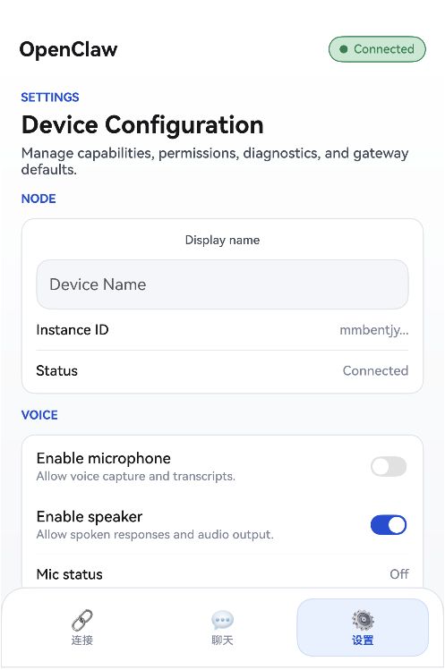

# OpenClaw HarmonyOS (Next) App

OpenClaw mobile client for HarmonyOS Next platform, migrated from Android.

## Project Structure

```
ohosApp/
├── AppScope/                      # Global application configuration
│   ├── app.json5                  # App bundle configuration
│   ├── build-profile.json5        # Build profile
│   ├── hvigorfile.ts              # Build script
│   └── resources/                 # Global resources
├── entry/                         # Main module
│   ├── src/main/
│   │   ├── ets/                   # ArkTS source code
│   │   │   ├── entryability/      # Entry ability
│   │   │   ├── api/               # API layer (Gateway, Auth)
│   │   │   ├── common/            # Common utilities
│   │   │   ├── model/             # Data models
│   │   │   ├── viewmodel/         # ViewModels
│   │   │   ├── components/        # Reusable components
│   │   │   └── pages/             # UI pages
│   │   ├── resources/             # Module resources
│   │   └── module.json5           # Module configuration
│   ├── build-profile.json5        # Module build profile
│   ├── hvigorfile.ts              # Module build script
│   └── oh-package.json5           # Module dependencies
├── hvigor/                        # Hvigor build tool config
├── hvigorfile.ts                  # Root build script
└── oh-package.json5               # Root dependencies
```

## Development Environment

- **IDE**: DevEco Studio 5.0+
- **SDK**: API 20 (HarmonyOS Next)
- **SDK Path**: `/Users/season/Library/OpenHarmony/Sdk/20`
- **Toolchain**: `/Users/season/Library/OpenHarmony/Sdk/20/toolchains`

## Features

### Migration Checklist

- [x] Project structure setup
- [x] App configuration (app.json5, module.json5)
- [x] Build configuration (build-profile.json5, hvigorfile.ts)
- [x] Data models (Gateway, Chat, Voice, etc.)
- [x] Network layer (WebSocket, HTTP)
- [x] Secure storage (encrypted preferences)
- [x] Entry Ability (main entry point)
- [x] Main ViewModel (state management)
- [x] UI Pages:
  - [x] Index (routing)
  - [x] Onboarding (4-step flow)
  - [x] Connect (gateway connection)
  - [x] Chat (AI chat interface)
  - [x] Voice (voice interaction)
  - [x] Screen (canvas/screen sharing)
  - [x] Settings (app configuration)
- [x] Resource files (strings, colors)
- [x] Permissions configuration

### Android → HarmonyOS Mapping

| Android | HarmonyOS |
|---------|-----------|
| Activity | UIAbility |
| Service | ExtensionAbility |
| BroadcastReceiver | CommonEvent |
| ContentProvider | DataShare |
| SharedPreferences | @ohos.data.preferences |
| Jetpack Compose | ArkUI (@Component, @Entry) |
| Kotlin Coroutines | async/await, Promise |
| Intent | Want |
| Context | Context |

### API Mappings

| Android API | HarmonyOS API |
|-------------|---------------|
| `android.net.http` | `@ohos.net.http` |
| `android.net.websocket` | `@ohos.net.websocket` |
| `androidx.security.crypto` | `@ohos.security.cryptoFramework` |
| `android.hardware.camera` | `@kit.CameraKit` |
| `android.location` | `@ohos.geoLocationManager` |
| `android.media.AudioRecord` | `@ohos.multimedia.audio` |
| `android.app.Notification` | `@ohos.notification` |

## Build & Run

### Prerequisites

1. Install DevEco Studio 5.0+
2. Configure HarmonyOS SDK (API 20)
3. Set up signing configuration

### Build Commands

Please Deveco studio open this project.

## Preview

- **Connect page**:


- **Chat page**:


- **Settings page**:




## Known Limitations

1. **WebView**: Canvas rendering uses WebView component - ensure A2UI host is reachable
2. **Permissions**: Some permissions require user grant at runtime
3. **Background Service**: Keep background running requires explicit permission
4. **Crypto**: Encryption implementation uses HarmonyOS cryptoFramework

## Next Steps

1. **Complete API Integration**:
   - Implement full gateway discovery (mDNS/DNS-SD)
   - Complete camera capture integration
   - Implement screen recording
   - Add SMS handling
   - Complete location services

2. **Testing**:
   - Unit tests for ViewModels
   - Integration tests for gateway communication
   - UI tests for all pages

3. **Optimization**:
   - Add image caching
   - Implement message persistence
   - Add offline support

4. **Polish**:
   - Add animations
   - Improve error handling
   - Add loading states
   - Localize strings

## Contributions

This is a migration of the OpenClaw Android app to HarmonyOS Next platform.
Maintainer: @obviyus (original Android), HarmonyOS migration by migration script.

## License

Apache-2.0
